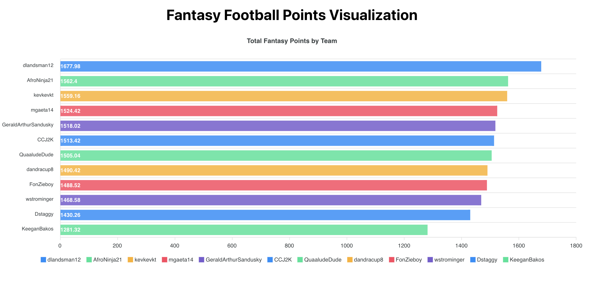

# Sleeper API Example

A simple fantasy football visualization using data from the [Sleeper API](https://docs.sleeper.com/#introduction). Made with React and ApexCharts.js.

A full tutorial can be found on [ffwrapped](https://ffwrapped.com/).
